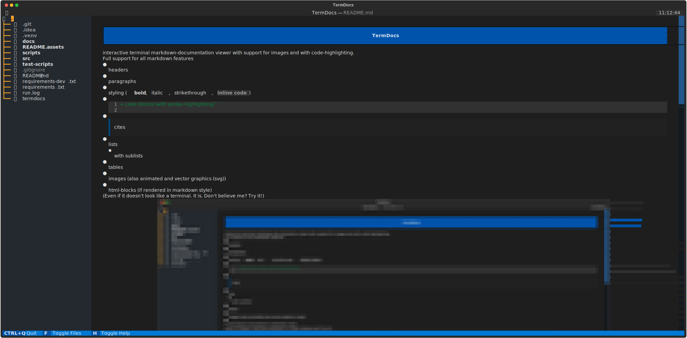
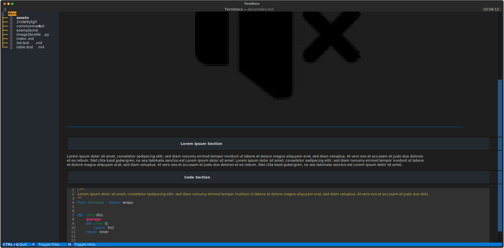
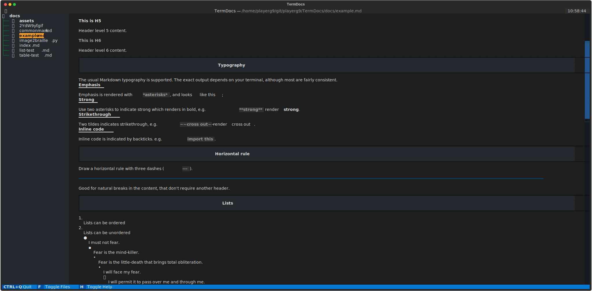
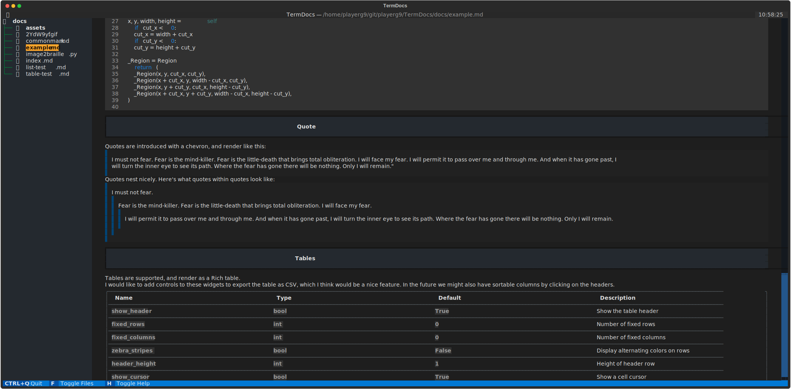

# TermDocs
interactive terminal markdown-documentation viewer with support for images and with code-highlighting.

Full support for all markdown features

- headers
- paragraphs
- styling (**bold**, *italic*, ~~strikethrough~~, `inline code`)
- ```diff
  + code blocks (with syntax-highlighting)
  ```
- > cites
- lists
  - with sublists
- tables
- images (also animated and vector graphics (svg))
- html-blocks (if rendered in markdown style)

<sup>(Even if it doesn't look like a terminal. It is. Don't believe me? Try it!)</sub>




