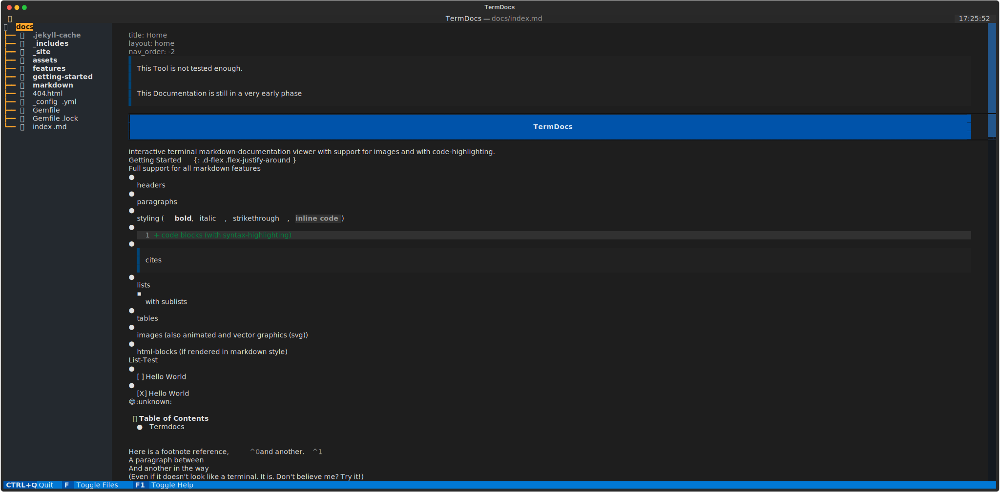

# Getting Started

{: .warning }
> These installation commands are currently written for linux only.
> They should also work on Mac-OS but no guaranty.

- TOC
{:toc}

Here is a detailed step-by-step guide. If you know a bit more and want to skip the explanations you can [go directly to the full commands](#full-commands)

## Dependencies

> bash
> {: .label }
> git/wget/curl
> {: .label }
> python3 (3.7+)
> {: .label }
> python-pip
> {: .label }
> python-venv
> {: .label }

Check which tool is available to get the repository.
`git` is recommended but the others are also possible.
```bash
# check what of git/wget/curl is installed
$ which {git,wget,curl}
/usr/bin/git
/usr/bin/wget
/usr/bin/curl
```

Check the python version. It should be 3.7+
```bash
$ python3 -V
Python 3.10.12
```

Check if pythons package manager is available.
```bash
$ python3 -c 'import pip' && python3 -m pip -V
pip 23.1.2 from /home/user/.local/lib/python3.10/site-packages/pip (python 3.10)
```
If the message is some form of error (`ModuleNotFoundError`)
Then you can run `python3 -m ensurepip`

Check if it's possible to create a virtual-environment.
```bash
$ python3 -c 'import venv' && echo "venv available"
venv available
```
Otherwise, you have to install the system package (`sudo apt install python3-venv`)
or another virtual-environment tool (`pip3 install virtualenv`)

## Getting the Repository 

Select one of the following

```bash
git clone https://github.com/PlayerG9/TermDocs.git
```
```bash
wget -q https://github.com/PlayerG9/TermDocs/archive/refs/heads/main.zip && unzip -q main.zip && rm main.zip && mv TermDocs-main TermDocs
```
```bash
curl -sLJo main.zip https://github.com/PlayerG9/TermDocs/archive/refs/heads/main.zip && unzip -q main.zip && rm main.zip && mv TermDocs-main TermDocs
```
Or download and unzip the [zip](https://github.com/PlayerG9/TermDocs/archive/refs/heads/main.zip) from GitHub yourself.

## Project Setup

First we will go into the Project folder

```bash
cd TermDocs
```

In order to not pollute your system-python environment we will use a virtual one.

```bash
# With pythons builtin venv:
python3 -m venv .venv
# With pip installable virtualenv
python3 -m virtualenv .venv
```

Afterward, we will install the dependencies.
```bash
./.venv/bin/pip3 install -U pip
./.venv/bin/pip3 install -U -r requirements.txt 
```

## Testing the installation

```bash
./termdocs docs/
```
which should open this documentation in the terminal.



# Full Commands

```bash
git clone https://github.com/PlayerG9/TermDocs.git
cd TermDocs
python3 -m venv .venv
./.venv/bin/pip3 install -U pip 
./.venv/bin/pip3 install -U -r requirements.txt 
```
