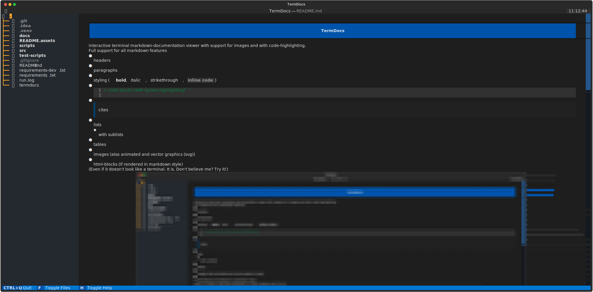
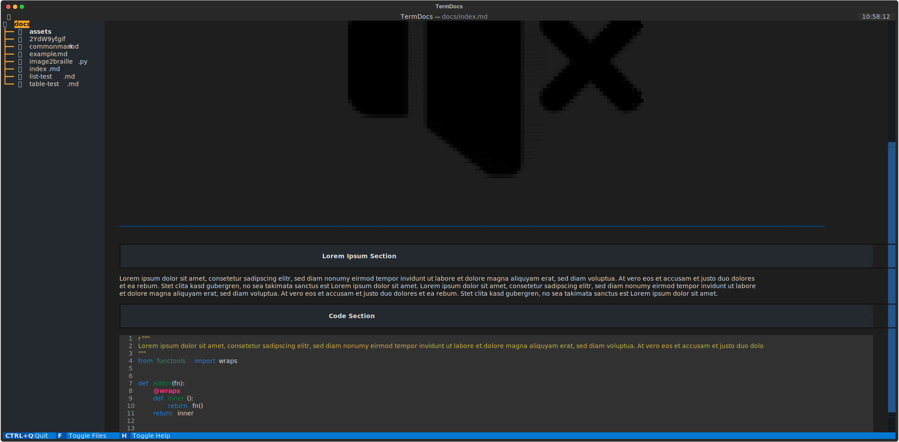
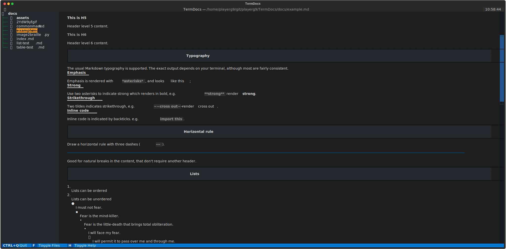
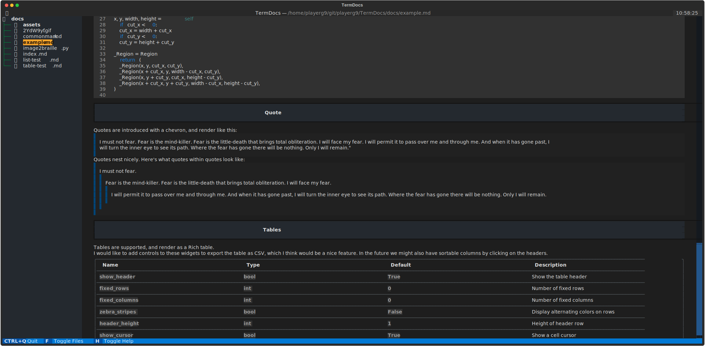

{: .warning }
> This Tool is not tested enough.

{: .warning }
> This Documentation is still in a very early phase

<!--
{:style="height: 30px"}
-->
#  TermDocs
{: .text-center }

interactive terminal markdown-documentation viewer with support for images and with code-highlighting.

[Getting Started](getting-started){: .btn .btn-blue .fs-5 }
{: .d-flex .flex-justify-around }

Full support for all markdown features

- headers
- paragraphs
- styling (**bold**, *italic*, ~~strikethrough~~, `inline code`)
- ```diff
  + code blocks (with syntax-highlighting)
  ```
- > cites
- lists
  - with sublists
- tables
- images (also animated and vector graphics (svg))
- html-blocks (if rendered in markdown style)

<sub>(Even if it doesn't look like a terminal. It is. Don't believe me? Try it!)</sub>




